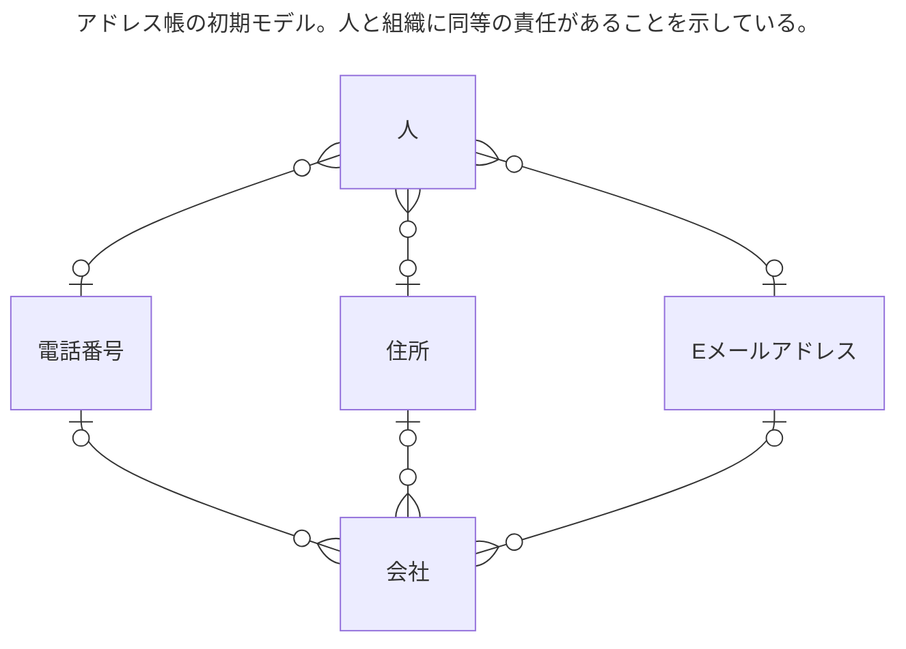
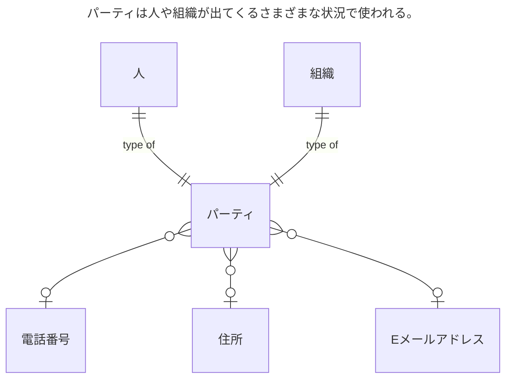

## 2.1 パーティ

人と会社の汎化。

## Naive model

```mermaid
---
title: アドレス帳の初期モデル。人と組織に同等の責任があることを示している。
---

erDiagram
    "人" }o--o| "電話番号": ""
    "人" }o--o| "住所": ""
    "人" }o--o| "Eメールアドレス": ""
    "電話番号" |o--o{ "会社": ""
    "住所" |o--o{ "会社": ""
    "Eメールアドレス" |o--o{ "会社": ""

```

## Refined model

```mermaid
---
title: パーティは人や組織が出てくるさまざまな状況で使われる。
---

erDiagram
    "人" ||--|| "パーティ" : "type of"
    "組織" ||--|| "パーティ" : "type of"
    "パーティ" }o--o| "電話番号": ""
    "パーティ" }o--o| "住所": ""
    "パーティ" }o--o| "Eメールアドレス": ""
```
