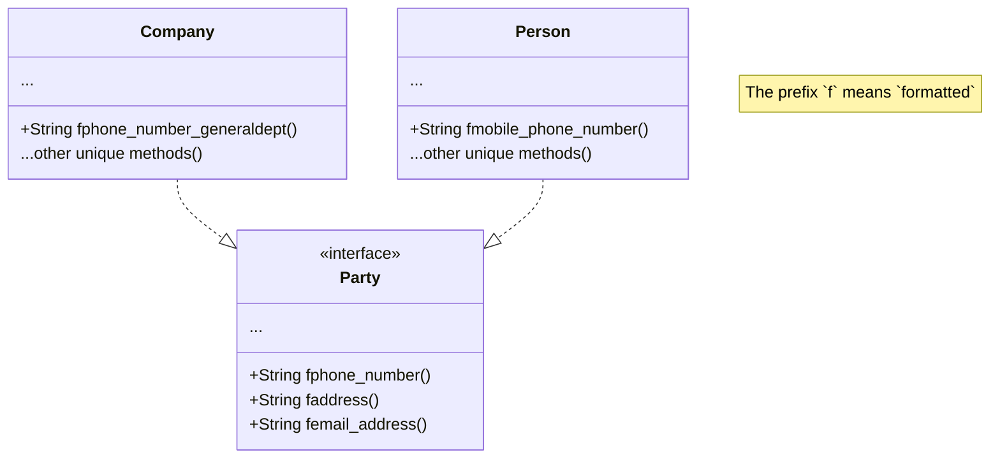

## 実装モデル (a)
Party を trait とし、特化型を struct とする。

## Aspects
この実装モデルの場合、特化型が異なる役割を持つことが可能となるが、
大抵の場合それは Single responsibility principle に違反するため、
それぞれの特化型クラスを分離したり、
別の境界付けられたコンテクストでそれらの関心ごとを扱うこととなる。

DB に永続化されたそれぞれの特化型を更新するユースケースにおいて、
更新のために Party として取り出したオブジェクトを、
どうやって特化型にのみ保存された不可視の属性と共に更新をかけるのかや、
同じDB上のレコードがユースケースなどによって実装モデルが異なり直感的でないという課題もある。
