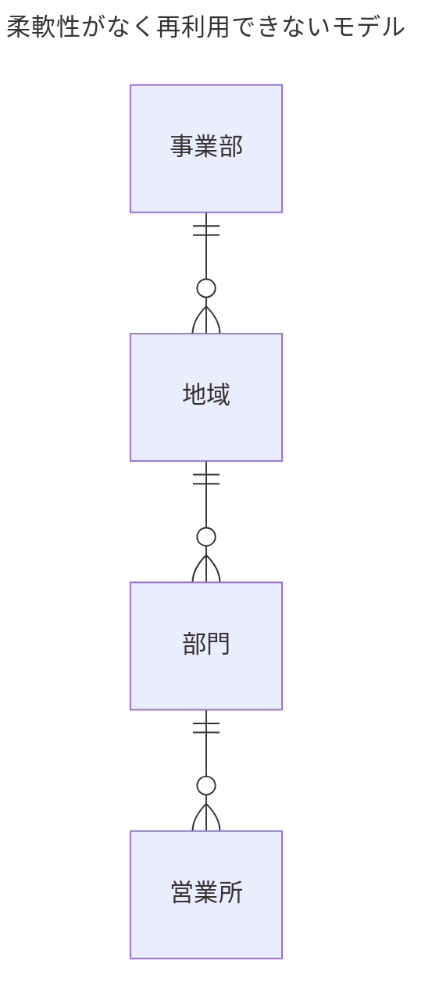
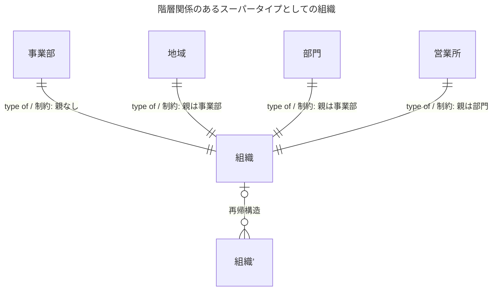

## 2.2 組織階層

構造の変化に対応できる再帰的組織モデル。

## Naive model

```mermaid
---
title: 柔軟性がなく再利用できないモデル
---

erDiagram
    "事業部" ||--o{ "地域" : ""
    "地域" ||--o{ "部門" : ""
    "部門" ||--o{ "営業所" : ""
```

## Refined model

```mermaid
---
title: 階層関係のあるスーパータイプとしての組織
---

erDiagram
    "事業部" ||--|| "組織" : "type of / 制約: 親なし"
    "地域" ||--|| "組織" : "type of / 制約: 親は事業部"
    "部門" ||--|| "組織" : "type of / 制約: 親は事業部"
    "営業所" ||--|| "組織" : "type of / 制約: 親は部門"
    "組織" |o--o{ "組織’" : "再帰構造"
```
